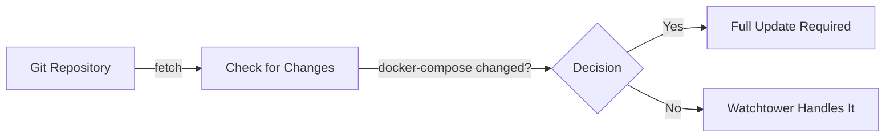

# Full Cluster Update Guide

## The Problem
Watchtower can only update container **images**, not:
- Docker-compose structure changes
- New/removed containers  
- Configuration changes (ports, volumes, environment)
- Network changes

## The Solution: Three-Layer Update System

### Layer 1: Watchtower (Image Updates Only)
✅ **What it handles:**
- Updates existing container images
- Runs continuously
- No downtime for simple image updates

❌ **What it can't handle:**
- Docker-compose changes
- New services
- Configuration changes

### Layer 2: Update Manager Container
✅ **What it handles:**
- Monitors git repository for changes
- Detects docker-compose modifications
- Performs full cluster rebuilds
- Health checks and rollbacks

### Layer 3: Systemd Service (Host-Level)
✅ **What it handles:**
- Runs outside containers
- Can update Docker itself
- Handles catastrophic failures
- Full system recovery

## Implementation Options

### Option 1: Lightweight (Watchtower + Script)
```bash
# Use existing Watchtower for images
# Run update script via cron for full updates
crontab -e
0 * * * * /home/geo/operation/scripts/orchestrator_full_update.sh --auto
```

### Option 2: Containerized (Update Manager)
```bash
cd /home/geo/operation/autonomy/update-manager
docker compose up -d

# Configure in update_config.yaml
# Set auto_update: true for automatic updates
```

### Option 3: System Service (Most Robust)
```bash
# Install as systemd service
chmod +x /home/geo/operation/scripts/install_update_service.sh
./scripts/install_update_service.sh

# Monitor updates
journalctl -u orchestrator-update.service -f
```

## How Full Updates Work

### 1. Detection Phase


### 2. Update Process
```bash
# Step 1: Pull latest code
git pull origin embody-alpha
git submodule update --init --recursive

# Step 2: Compare docker-compose
diff docker-compose.yml docker-compose.yml.new

# Step 3: If changed, rebuild cluster
docker compose down
docker compose up -d

# Step 4: Health checks
curl http://localhost:8082/health
curl http://localhost:5001/health
curl http://localhost:8200/health

# Step 5: Rollback if failed
if [ $? -ne 0 ]; then
    git checkout previous-version
    docker compose down
    docker compose up -d
fi
```

## Configuration Examples

### Minimal Setup (Just Watchtower)
```yaml
services:
  watchtower:
    image: containrrr/watchtower
    volumes:
      - /var/run/docker.sock:/var/run/docker.sock
    command: --interval 300 --cleanup
```

### Full Auto-Update Setup
```yaml
services:
  # Image updates
  watchtower:
    image: containrrr/watchtower
    command: --label-enable --scope autonomy-cluster
    
  # Cluster updates  
  update_manager:
    image: alpine/git:latest
    volumes:
      - /var/run/docker.sock:/var/run/docker.sock
    environment:
      - AUTO_UPDATE=true
      - UPDATE_INTERVAL=3600
```

### Production Setup (Manual Approval)
```yaml
services:
  update_manager:
    environment:
      - AUTO_UPDATE=false  # Notify only
      - WEBHOOK_URL=https://hooks.slack.com/YOUR/WEBHOOK
```

## Handling Breaking Changes

### Scenario 1: Add New Service
```yaml
# Old docker-compose.yml
services:
  orchestrator: ...
  neurosync_s1: ...

# New docker-compose.yml  
services:
  orchestrator: ...
  neurosync_s1: ...
  new_service: ...  # Watchtower can't add this!
```
**Solution**: Update Manager detects change and rebuilds cluster

### Scenario 2: Rename Container
```yaml
# Old
services:
  old_name:
    container_name: old_container

# New
services:
  new_name:
    container_name: new_container
```
**Solution**: Full update removes old, creates new

### Scenario 3: Change Ports/Volumes
```yaml
# Old
ports:
  - "8080:8080"

# New  
ports:
  - "9090:8080"  # Watchtower won't update this!
```
**Solution**: Update Manager rebuilds with new configuration

## Manual Update Commands

### Force Immediate Update
```bash
# Option 1: Via script
/home/geo/operation/scripts/orchestrator_full_update.sh

# Option 2: Via systemd
sudo systemctl start orchestrator-update.service

# Option 3: Via docker
docker exec update_manager sh -c 'kill -USR1 1'
```

### Check Update Status
```bash
# Check if updates available
cd /home/geo/operation/autonomy
git fetch
git status

# View update logs
docker logs update_manager
journalctl -u orchestrator-update.service
```

### Disable Updates
```bash
# Stop Watchtower
docker stop watchtower_orchestrator

# Stop Update Manager
docker stop update_manager

# Disable systemd timer
sudo systemctl stop orchestrator-update.timer
```

## Best Practices

1. **Test Updates in Staging First**
   ```bash
   # Set environment
   export ENVIRONMENT=staging
   docker compose up -d
   ```

2. **Always Backup Before Major Updates**
   ```bash
   # Backup script creates automatic backups
   ls -la /home/geo/operation/backups/
   ```

3. **Monitor Health After Updates**
   ```bash
   # Health check script
   for port in 8082 5001 8200; do
     curl -sf http://localhost:$port/health && echo "✓ Port $port healthy"
   done
   ```

4. **Use Semantic Versioning**
   ```yaml
   # Tag your docker-compose versions
   # docker-compose.v1.yml
   # docker-compose.v2.yml
   ```

5. **Gradual Rollout**
   ```bash
   # Update one orchestrator at a time in multi-node setup
   ansible orchestrators -m shell -a "systemctl start orchestrator-update" --forks=1
   ```

## Recovery Procedures

### If Update Fails
```bash
# 1. Check logs
docker logs update_manager
journalctl -u orchestrator-update.service

# 2. Manual rollback
cd /home/geo/operation/backups/latest/autonomy
docker compose down
docker compose up -d

# 3. Disable auto-updates until fixed
docker stop update_manager
```

### If Cluster is Broken
```bash
# Emergency recovery
cd /home/geo/operation
git checkout stable-version
cd autonomy
docker compose down --volumes
docker compose up -d
```

## Summary

- **Watchtower**: Handles image updates (90% of updates)
- **Update Manager**: Handles docker-compose changes (9% of updates)  
- **Manual Intervention**: Required for breaking changes (1% of updates)

This three-layer approach ensures your cluster stays updated while maintaining stability and control.