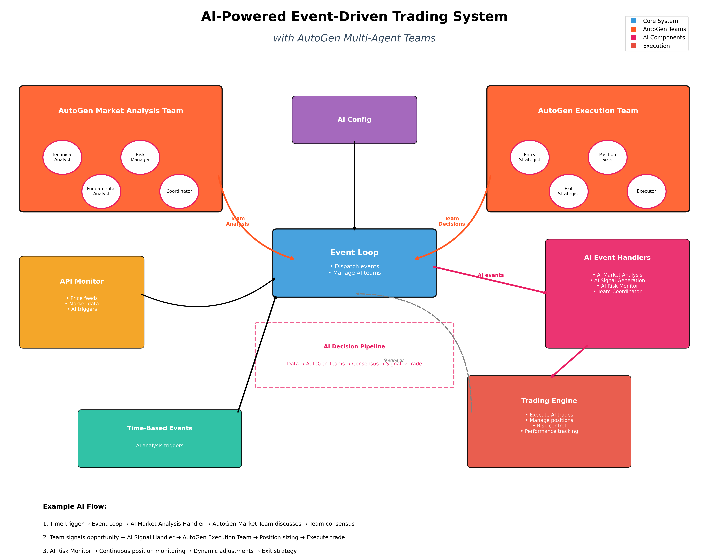

# AI-Powered Event-Driven Trading System

An intelligent trading system combining event-driven architecture with AutoGen AI teams for sophisticated market analysis and autonomous decision-making.

## Architecture



## Key Features

- **AI-Powered**: AutoGen multi-agent teams for intelligent trading decisions
- **Event-Driven**: All actions triggered by events (time-based or API conditions)
- **Multi-Agent Intelligence**: 
  - Market Analysis Team: Technical, Fundamental, and Risk agents
  - Execution Team: Entry, Exit, and Position Sizing agents
- **Adaptive Learning**: AI teams improve decisions over time
- **Explainable AI**: Teams provide reasoning for all trading decisions
- **Modular Design**: Clear separation of concerns
- **Paper Trading**: Safe testing with simulated trades

## System Components

### 1. Event Loop (`event_loop.py`)
The heart of the system. Manages all events and dispatches them to handlers.

### 2. AutoGen AI Teams (`autogen_teams.py`)
Multi-agent teams that collaborate on trading decisions:
- **Market Analysis Team**:
  - Technical Analyst: Analyzes price patterns and indicators
  - Fundamental Analyst: Evaluates market conditions
  - Risk Manager: Assesses risk/reward ratios
  - Coordinator: Synthesizes team insights
- **Execution Team**:
  - Entry Strategist: Determines optimal entry points
  - Exit Strategist: Manages stops and targets
  - Position Sizer: Calculates optimal position sizes
  - Executor: Finalizes execution parameters

### 3. AI Event Handlers (`ai_handlers.py`)
AI-powered handlers that leverage AutoGen teams:
- `AIMarketAnalysisHandler`: Triggers team analysis every minute
- `AISignalHandler`: Processes team decisions into trades
- `AIRiskMonitorHandler`: Continuous AI position monitoring
- `AIPerformanceHandler`: AI team performance reviews

### 4. Traditional Event Handlers (`handlers.py`)
Fallback handlers for non-AI operation:
- `MarketScanHandler`: Basic market scanning
- `PositionMonitorHandler`: Simple position monitoring
- `PriceSpikeHandler`: Responds to price spikes
- `PriceCrashHandler`: Responds to price drops
- `PerformanceHandler`: Basic performance tracking

### 5. API Monitor (`monitor.py`)
Watches external APIs for specific conditions and triggers events.

### 6. Trading Engine (`trading.py`)
Executes trades and manages positions with risk controls. AI teams can override parameters for optimal execution.

## Configuration

Edit `config.yaml` to configure:
- **AI Settings**: OpenAI API key, model selection, team parameters
- **Trading parameters**: Balance, position sizing, stops
- **AI Events**: Analysis frequency, confidence thresholds
- **Traditional Events**: Fallback market scans
- **API monitors**: External data sources and triggers

### AI Configuration Example:
```yaml
ai_config:
  api_key: "${OPENAI_API_KEY}"
  model: "gpt-4"
  teams:
    market_analysis:
      max_rounds: 5
      min_confidence: 70
```

## Quick Start

### Using Docker:
```bash
docker-compose up -d
```

### Without Docker:
```bash
pip install -r requirements.txt
python run.py
```

## Event Flow Example

1. **Time Trigger**: Every 30 seconds, `market_scan` event fires
2. **Event Loop**: Dispatches to `MarketScanHandler`
3. **Handler**: Analyzes market, finds opportunity
4. **Trading Engine**: Opens position
5. **Dynamic Event**: Handler schedules position check in 60 seconds
6. **Position Monitor**: Checks stop/target, manages exit

## Adding New Features

### New Event Type:
1. Add configuration in `config.yaml`
2. Create handler in `handlers.py`
3. Register in `HandlerRegistry`

### New API Monitor:
1. Add to `api_monitors` in config
2. Define conditions and handlers

## Design Principles

1. **Simplicity**: No unnecessary complexity
2. **Modularity**: Each component has single responsibility
3. **Readability**: Clear variable names, documented functions
4. **Extensibility**: Easy to add new event types or handlers
5. **Reliability**: Graceful error handling, no crashes

## File Structure

```
event-driven-trader/
├── config.yaml              # All configuration
├── src/
│   ├── event_loop.py        # Main event loop
│   ├── events.py            # Event definitions
│   ├── handlers.py          # Traditional event handlers
│   ├── ai_handlers.py       # AI-powered handlers
│   ├── autogen_teams.py     # AutoGen multi-agent teams
│   ├── trading.py           # Trading engine
│   ├── monitor.py           # API monitor
│   ├── diagram_generator.py # Auto diagram generation
│   └── diagram_handler.py   # Diagram update handler
├── run.py                   # Entry point
├── update_diagram.py        # MCP-like diagram updater
├── architecture_ai.png      # Current architecture diagram
├── requirements.txt         # Dependencies
├── Dockerfile              # Container setup
└── docker-compose.yml      # Easy deployment
```

## Automatic Architecture Diagram Updates

The system includes an MCP-like tool for automatic diagram generation:

### Manual Update:
```bash
python update_diagram.py
```

### Watch Mode (Auto-Update):
```bash
python update_diagram.py --watch
```

### Features:
- Detects code changes automatically
- Regenerates architecture diagram
- Analyzes AI components
- Can be integrated into event loop for continuous updates

## Monitoring

The system logs all activities to stdout. Key events:
- Trade executions with reasons
- Position updates
- Performance reports
- API condition triggers

## Safety Features

- Paper trading only (no real money)
- Position limits
- Stop loss on every trade
- Maximum position time
- Graceful shutdown handling